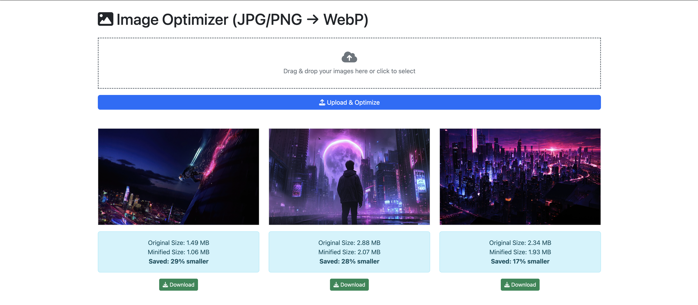

# Image Optimizer 📸

This is a simple Express application for uploading and optimizing images. The images are converted to the WebP format, and their sizes are minimized using **lossy compression** with the help of the **Sharp** library.

<p align="center">
  
</p>

---

## ⚙️ Features

- 🖼️ **Upload Images**: Allows users to upload up to 9 images at a time.
- ⚡ **Optimize Images**: Converts uploaded images to the WebP format using Sharp.
- 📊 **File Size Reduction**: Shows the original and minified sizes of the images along with the percentage of size saved.
- 🔄 **Base64 Encoding**: Generates a data URL for each image to easily embed the image in HTML.

---

## 🛠️ Technologies Used

- **Express**: Web framework for Node.js
- **Multer**: Middleware for handling file uploads
- **Sharp**: High-performance image processing library
- **EJS**: Templating engine for rendering HTML views

---

## 🚀 Installation

1. Clone the repository:
    ```bash
    git clone https://github.com/NeaByteLab/Image-Optimizer.git
    cd Image-Optimizer
    ```
2. Install dependencies:
    ```bash
    npm install
    ```

3. Start the server:
    ```bash
    npm start
    ```

4. Access the app at `http://localhost:3000`

---

## 📦 How to Use
- Upload Images: Use the file input on the homepage to select images.
- Optimization: After uploading, the images will be automatically optimized and displayed with their original size and minified size.
- Download: The optimized images will be available in a base64-encoded format for easy embedding.

---

## 📝 License
MIT License © 2025 [NeaByteLab](https://github.com/NeaByteLab)